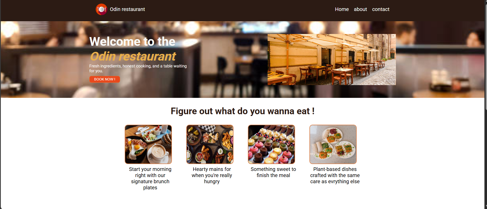

# Odin Restaurant - Landing page
a landing page built as part of [The Odin Project's Foundations course](https://www.theodinproject.com/lessons/foundations-landing-page).
Built using Flexbox for Layout, with custom restaurant theme instead of the default exercise content.

## Screeshots

## What i peacticed
- Flexbox layout (row/column, justifycontent, align-items, flex: 1)
- Responsive design with flex-wrap and media queries
- Foxong common flex pitfalls (flex-shrink, box-sizing/padding issues)
